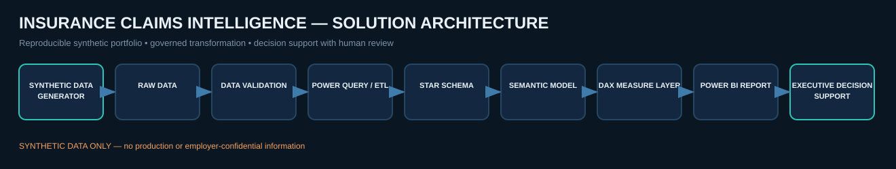
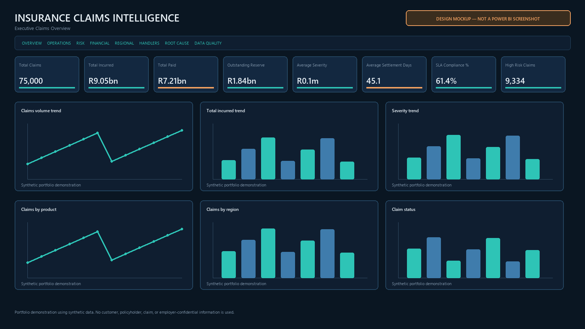
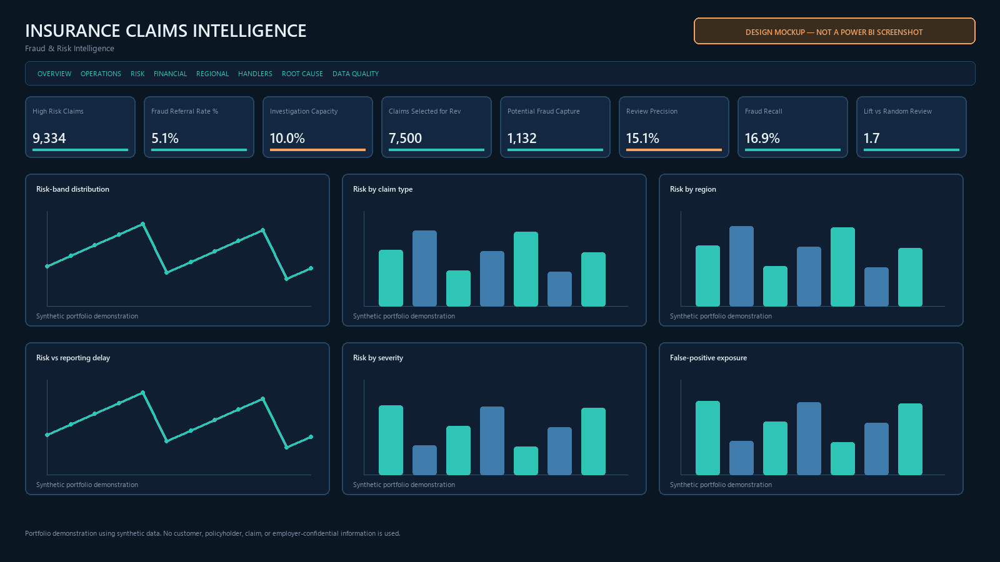
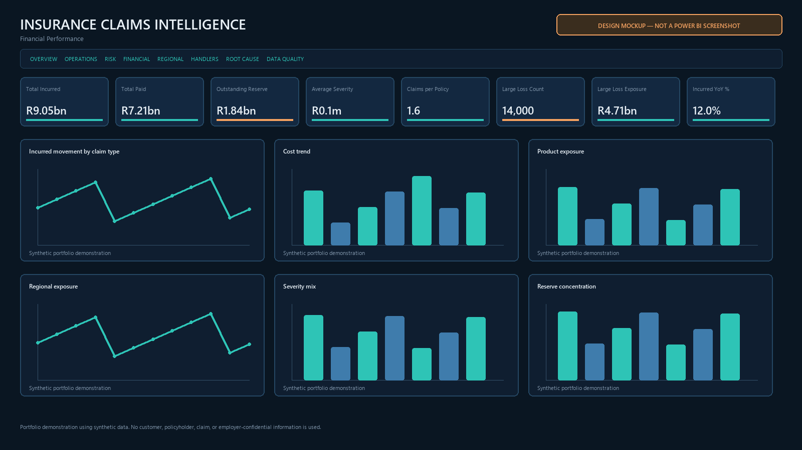
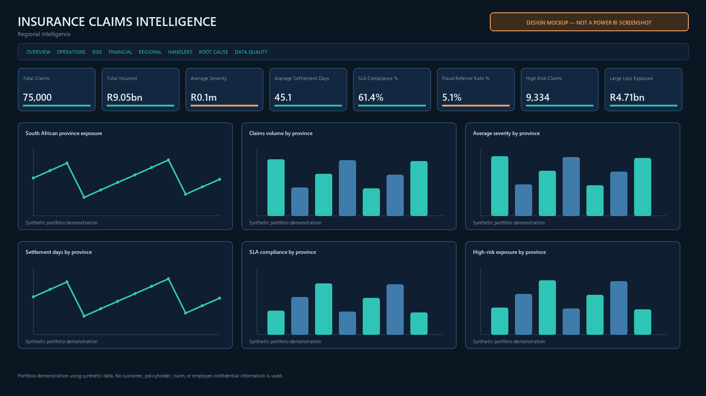
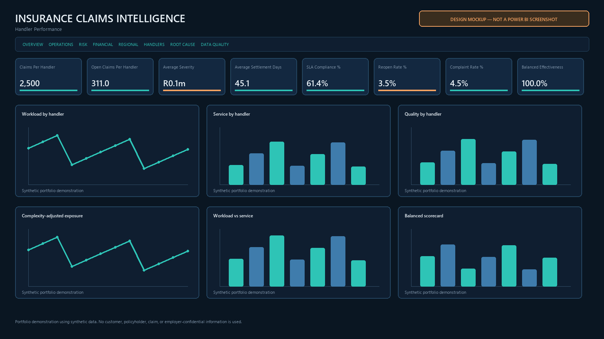
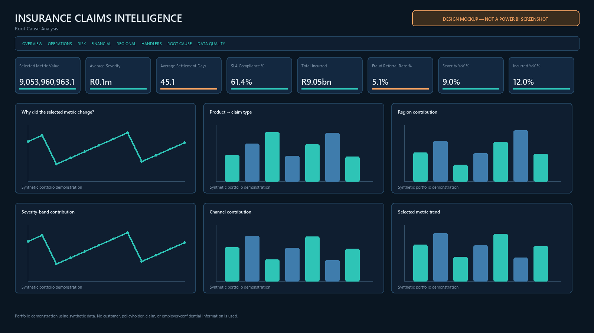
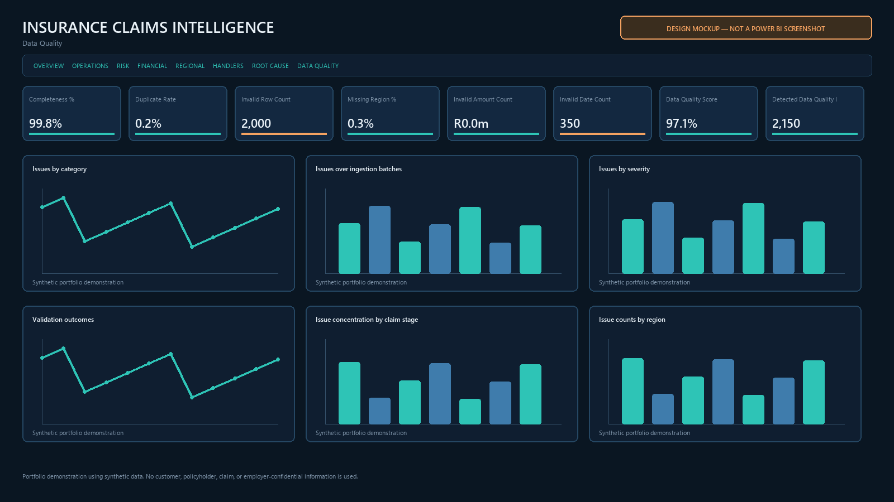
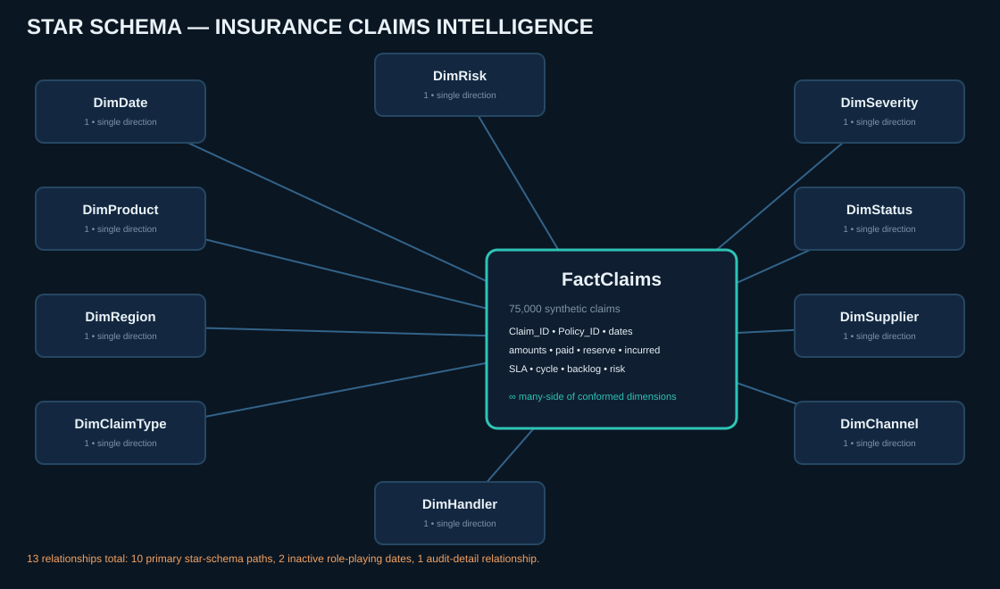

# Insurance Claims Intelligence

[](https://github.com/GarethMackenzie/insurance-claims-intelligence-powerbi/actions/workflows/ci.yml)

## Executive Power BI & Analytics Engineering Portfolio Project

Source-controlled decision support for claims performance, financial exposure, service, operations and risk-based human review.

> **Portfolio demonstration using synthetic data only.** No customer, policyholder, claim, or employer-confidential information is used. All findings are synthetic portfolio findings, not workplace achievements.

**Source/runtime status:** Structurally validated from PBIP/PBIR/TMDL source. Final visual rendering and interaction verification requires a current Power BI Desktop host.

**Portfolio evidence:** 75,000 synthetic claims · 79 DAX measures · 8 report pages · PBIP/PBIR/TMDL · Power Query · Python · SQL · automated QA and GitHub Actions

## Executive Summary

This is a source-controlled Power BI decision-support project for claims performance, financial exposure, service, backlog and risk-based human review. It combines reproducible data engineering with an inspectable semantic model and executive analytical storytelling.

## Business Problem

Claims leaders need a governed view of cost, severity, lifecycle delay, SLA, backlog, reserve exposure, regional concentration and limited fraud-review capacity. This solution is designed around management questions: what changed, where pressure is building, why it matters, and what to investigate next.

## Solution Overview

**Problem:** Claims leaders need trustworthy visibility into cost, delays, reserves, SLA and constrained risk-review capacity.

**Approach:** Synthetic generation → validation → governed cleaning → star schema → Power Query → TMDL → DAX → PBIR → executive report → automated QA.

**Result:** A reproducible, privacy-safe executive analytics solution. Synthetic financial values are demonstration results, not workplace achievements.

| Capability | Evidence in this repository |
|---|---|
| Governed data pipeline | Deterministic Python generation, independent validation, correction audit and clean star-schema build |
| Power BI engineering | Editable PBIP, enhanced PBIR and TMDL source with explicit relationships and a dedicated measure table |
| Claims analytics | Executive, operations, financial, regional, handler, root-cause, risk-review and data-quality views |
| Analytical depth | 79 DAX measures, reusable Power Query M, six SQL modules and a capacity-constrained review simulator |
| Quality controls | Reproducibility, reconciliation, semantic-model, privacy, asset, link and CI contract checks |

## Executive Portfolio Snapshot

| Metric | Synthetic result |
|---|---:|
| Claims | 75,000 |
| Open claims | 9,331 |
| Total incurred | R9.05bn |
| Outstanding reserve | R1.84bn |
| Average severity | R143,507 |
| Median settlement days | 39 |
| SLA compliance | 61.4% |
| High/Critical risk share | 12.4% |
| Data quality detection | 2,150 / 2,150 (100%) |

### Key synthetic findings

1. **Fire leads incurred exposure** — It contributes R1,653,712,314, or 18.3%, of total incurred.
2. **Free State has the strongest comparable severity increase** — Synthetic average severity is +15.9% versus January–August 2025.
3. **Aged open claims concentrate reserve exposure** — They represent 75.0% of open claims and 79.9% of open-claim reserves.
4. **Assessment is the weakest open-stage SLA segment** — SLA compliance is 39.7% for the segment.
5. **High-risk concentration is greatest in KwaZulu-Natal** — The concentration is 15.8% of claims in the province.
6. **Agricultural claims have the longer median settlement cycle** — Agricultural records 67 days versus 32 days for the other product.

Evidence, implications and cautious action framing are in [executive-insights.md](docs/executive-insights.md).

## Architecture



`synthetic raw data → validation audit → governed clean star schema → Power Query → TMDL semantic model → enhanced PBIR report source → automated QA`

See [architecture](docs/architecture.md) and [methodology](docs/methodology.md).

## Dashboard / Report Pages

These images are **design mockups, not Power BI screenshots**. The editable visual definitions are in [`InsuranceClaimsIntelligence.Report`](InsuranceClaimsIntelligence.Report/definition/pages/).

| Executive overview | Claims operations |
|---|---|
|  |  |
| Risk & review | Financial performance |
|  |  |
| Regional intelligence | Handler performance |
|  |  |
| Root-cause analysis | Data quality |
|  |  |

Page scope and implementation status are documented in [report-pages.md](docs/report-pages.md).

Recruiter-focused captions and management decisions are in the [report page guide](docs/report-page-guide.md).

## Data Model



`FactClaims` is one row per claim. Ten conformed dimensions filter it in a single direction across 13 relationships. `DimDate[Date]` is the marked date column; loss date is active, while report and settlement dates are inactive role-playing paths. The complete [data dictionary](docs/data-dictionary.md) documents 110 physical fields.

## DAX & Semantic Layer

The model discourages implicit measures and provides 79 documented measures for financial exposure, severity, service, backlog, time intelligence, review capacity and balanced workload analysis. Ratios use `DIVIDE`; open-claim logic uses the governed status flag; month, status, severity and risk labels have explicit sort columns. See the [DAX catalogue](dax/measures.md).

## Power Query & Data Quality

Reusable M centralizes UTF-8 CSV loading and schema enforcement. The raw layer contains 75,150 rows and 2,150 controlled issue events; validation detects every event before the clean build applies explicit corrections and reconciles to 75,000 unique claims. See [Power Query design](docs/power-query.md) and [data-quality evidence](docs/data-quality.md).

## SQL Analytics

[`sql/`](sql/) contains six ANSI-oriented modules covering dimensional DDL, validation controls, lifecycle performance, review-capacity prioritization and financial exposure. The examples use CTEs, guarded division, CASE expressions and window functions.

## Reproducibility

The fixed seed `20260831`, project-relative inputs and deterministic scripts reproduce the dataset and source artifacts. Run the pipeline in this order: generate → validate → clean build → project build → QA.

## Quality Assurance

`python scripts/qa_project.py` reruns the full build and tests data grain, controlled defects, financial reconciliation, date semantics, PBIP/PBIR references, TMDL structure, DAX conventions, CI wiring, SQL/Python syntax, internal links, privacy and mockup integrity. The latest evidence is in [qa-report.md](docs/qa-report.md).

Automated QA does not prove rendering. The separate [runtime evidence record](docs/power-bi-runtime-verification.md) remains **MANUAL REVIEW**, with exact steps in the [Desktop verification checklist](docs/desktop-verification-checklist.md).

## Recruiter Walkthrough

A natural [60–90 second walkthrough](docs/project-walkthrough.md) and [technical interview guide](docs/interview-guide.md) explain the business problem, architecture, semantic-model decisions, responsible analytics and production boundary without presenting synthetic results as workplace achievements.

## Responsible Analytics & Limitations

Risk scores prioritize human review; they never determine fraud or automate a claim decision. Synthetic targets exist only to demonstrate queue metrics. Reserves are simplified case reserves, RLS is conceptual, and handler views support workload management rather than employee evaluation. See [limitations](docs/limitations.md) and [RLS notes](docs/row-level-security.md).

## How to Run

From the repository root:

```powershell
python -m venv .venv
.venv\Scripts\Activate.ps1
pip install -r requirements.txt
python scripts/generate_synthetic_claims.py
python scripts/validate_data.py
python scripts/build_clean_dataset.py
python scripts/build_project.py
python scripts/qa_project.py
```

Open [`InsuranceClaimsIntelligence.pbip`](InsuranceClaimsIntelligence.pbip) in a current Power BI Desktop release, set `pProjectRoot` to the clone path, refresh, and complete the [Desktop verification checklist](docs/desktop-verification-checklist.md). Setup details are in [power-bi-setup.md](docs/power-bi-setup.md).

## Repository Structure

```text
InsuranceClaimsIntelligence.pbip
InsuranceClaimsIntelligence.Report/       enhanced PBIR report source
InsuranceClaimsIntelligence.SemanticModel/ TMDL semantic model source
data/raw/ and data/clean/                  reproducible synthetic extracts
scripts/                                   generation, validation, clean build and QA
powerquery/                                reusable M and staging examples
dax/                                       measure catalogue and field parameter
sql/                                       six analytical SQL modules
docs/                                      architecture, method, governance and setup
assets/                                    diagrams and labelled design mockups
theme/                                     Power BI theme JSON
```

## Author

**Gareth Andrew Mackenzie**<br>
Johannesburg, South Africa

`Power BI` · `DAX` · `Power Query` · `TMDL` · `PBIP/PBIR` · `Python` · `SQL` · `Insurance analytics`

Licensed under the [MIT License](LICENSE).
